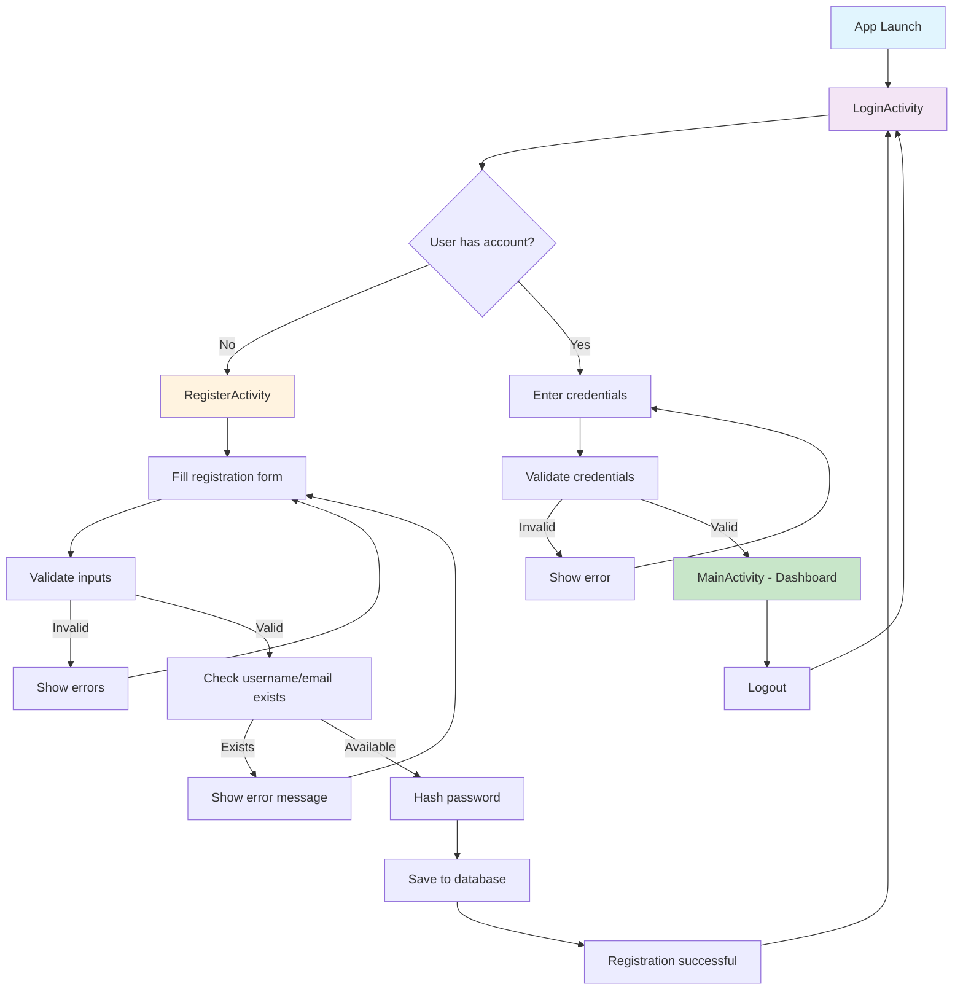

# DoseBuddy Registration Flow

## Mermaid Diagram Code

## Flow Description

1. **App Launch**: User opens DoseBuddy app
2. **LoginActivity**: Entry point for authentication
3. **Registration Path**: New users fill registration form with validation
4. **Login Path**: Existing users authenticate with credentials
5. **Dashboard**: Successful authentication leads to main app functionality
6. **Logout**: Users can return to login screen

## Key Features

- **Input Validation**: Real-time validation of all form fields
- **Security**: Password hashing with SHA-256 and salt
- **Database**: Local Room database for offline functionality
- **Error Handling**: User-friendly error messages
- **Material Design**: Modern Android UI components
